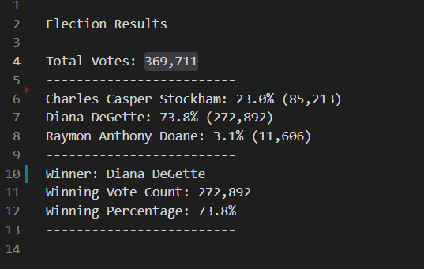

# Election Analysis 

## Overview of Election Audit

### Purpose

The purpose of this project is to assist Tom, a Colorado Board of Elections employee, in an election audit of the tabulated results for U.S. Congressional precinct in Colorado. This project aims to report the total number of votes cast, the total number of votes for each candidate, the percentage of votes for each candidate, and the winner of the election based on the popular vote. This project will also investigate the results of the election by county.

## Election-Audit Results 

- How many votes were cast in this congressional election? 

In total, there were 369,711 votes.

- Provide a breakdown of the number of votes and the percentage of total votes for each county in the precinct.  

Of the 369,711 votes, 10.5% of them came from Jefferson, 82.8% from Denver, and 6.7% from Arapahoe.  

- Which county had the largest number of votes?  

Denver has the largest number of votes (306,055).

- Provide a breakdown of the number of votes and the percentage of the total votes each candidate received.  

Of the 369,711 votes, 23% of them went towards Charles Casper Stockham, 73.8% towards Diana DeGette, and 3.1% towards Raymon Anthony Doane.  

### Election Results  
  

- Which candidate won the election, what was their vote count, and what was their percentage of the total votes?  

Diana DeGette won the election with 272,892 votes - 73.8% of the percentnage of total votes.

## Election-Audit Summary  

This script can be used for virtually any election, in any region, as long as three elements are replaced: the candidate names, the counties, and the data set. This is as simple as going back to the code and replacing the new candidate and county names with the ones currently listed. The algorithm still functions the same, but the variables would be different. Finally, and obviously, the data that was used to pull the quantity of votes would have to be replaced; preferrably in csv format.
